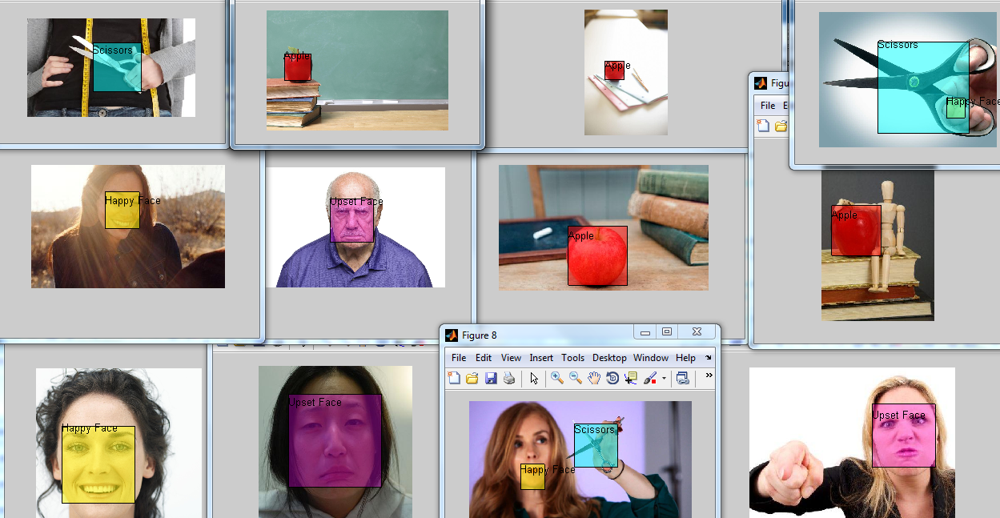

# Object Detection

This code in this repo downloads a set of images off google images then uses Cascade Training to attempt to recognize objects.  The testing shows fairly good results as shown below.

<p align="center">
  
</p>


# Building Training Database 

To get new sample photos, run the following.  After completed, you must train on these new objects

```matlab
create_image_database('angry person') 
```
where angry person is the subject you want to retrieve pictures of

# Run Main Detector

1) Change in cascadeTrainer directory 
2) Run TestClassifier.m 
3) Select image to test once prompted 


# Train for new objects

To train on more images or add new objects: 
1) Double click on Cascade Trainer.mlappinstall 
2) Follow on-screen instructions to install app 
3) Open Cascade Trainer App 
4) Add training pictures to set and create bounding boxes around objects of interest 
5) Click the Train Cascade Detector tab 
6) Add negative images (do not include the objects you wish to find) 
7) Click Train Detector and let it run 
8) A new .xml file will be created. To use it, look in the TestClassifier.m for example usage